# Library Management System - Design Document

## Overview
This document describes the design and architecture of the Library Management System, implemented following Zoho Machine Coding best practices with clean separation of concerns, command pattern implementation, and comprehensive business logic coverage.

## Architecture Overview
The system follows a layered architecture with three main layers:
- **Entity Layer**: Domain objects representing core business entities
- **Service Layer**: Business logic and data management
- **Controller Layer**: Command handling and user interaction

## UML Class Diagram

```mermaid
classDiagram
    %% Entity Classes
    class Book {
        -String title
        -String author
        -String book_id
        -Member member
        +Book(String title, String author, String book_id)
        +getTitle() String
        +setTitle(String title)
        +getAuthor() String
        +setAuthor(String author)
        +getBookId() String
        +setBookId(String book_id)
        +getMember() Member
        +setMember(Member member)
        +equals(Object obj) boolean
        +hashCode() int
        +toString() String
    }

    class Member {
        -String name
        -String id
        +Member(String name, String id)
        +getName() String
        +setName(String name)
        +getId() String
        +setId(String id)
        +equals(Object obj) boolean
        +hashCode() int
        +toString() String
    }

    class Librarian {
        -String personalId
        +Librarian(String name, String id)
        +getPersonalId() String
        +setPersonalId(String personalId)
        +toString() String
    }

    class Library {
        -List~Book~ books
        -List~Member~ members
        -List~Librarian~ librarians
        +Library(List~Book~ books, List~Member~ members, List~Librarian~ librarians)
        +getBooks() List~Book~
        +setBooks(List~Book~ books)
        +getMembers() List~Member~
        +setMembers(List~Member~ members)
        +getLibrarians() List~Librarian~
        +setLibrarians(List~Librarian~ librarians)
    }

    %% Service Class
    class LibraryManagementService {
        -Library library
        -List~Book~ books
        -List~Librarian~ librarians
        -List~Member~ members
        -Map~Book, Member~ activeBorrowing
        +LibraryManagementService(Library library)
        +searchBook(String title) Book
        +findBookById(String bookId) Book
        +findMemberById(String memberId) Member
        +findLibrarianById(String librarianId) Librarian
        +borrowBook(Member member, String bookId) boolean
        +returnBook(Member member, String bookId) boolean
        +addBook(Book book, Librarian librarian) boolean
        +removeBook(Book book, Librarian librarian) boolean
        +addMember(Member member) boolean
        +removeMember(Member member) boolean
    }

    %% Controller Classes
    class CommandHandler {
        <<interface>>
        +execute(String[] args)
    }

    class CommandDispatcher {
        -Map~String, CommandHandler~ commandMap
        -LibraryManagementService service
        +CommandDispatcher(LibraryManagementService service)
        -initializeCommands()
        +process(String input)
    }

    class AddBookCommand {
        -LibraryManagementService service
        +AddBookCommand(LibraryManagementService service)
        +execute(String[] args)
    }

    class RemoveBookCommand {
        -LibraryManagementService service
        +RemoveBookCommand(LibraryManagementService service)
        +execute(String[] args)
    }

    class BorrowBookCommand {
        -LibraryManagementService service
        +BorrowBookCommand(LibraryManagementService service)
        +execute(String[] args)
    }

    class ReturnBookCommand {
        -LibraryManagementService service
        +ReturnBookCommand(LibraryManagementService service)
        +execute(String[] args)
    }

    class AddMemberCommand {
        -LibraryManagementService service
        +AddMemberCommand(LibraryManagementService service)
        +execute(String[] args)
    }

    class RemoveMemberCommand {
        -LibraryManagementService service
        +RemoveMemberCommand(LibraryManagementService service)
        +execute(String[] args)
    }

    class SearchBookCommand {
        -LibraryManagementService service
        +SearchBookCommand(LibraryManagementService service)
        +execute(String[] args)
    }

    class HelpCommand {
        -LibraryManagementService service
        +HelpCommand(LibraryManagementService service)
        +execute(String[] args)
    }

    %% Main Class
    class Main {
        +main(String[] args)
        -initializeLibrary() Library
    }

    %% Relationships
    Librarian --|> Member : extends
    Book --> Member : "borrowedBy 0..1"
    Library *-- Book : "contains *"
    Library *-- Member : "contains *"
    Library *-- Librarian : "contains *"
    LibraryManagementService --> Library : "manages"
    LibraryManagementService --> Book : "manages *"
    LibraryManagementService --> Member : "manages *"
    LibraryManagementService --> Librarian : "manages *"
    CommandDispatcher --> LibraryManagementService : "uses"
    CommandDispatcher --> CommandHandler : "contains *"
    AddBookCommand ..|> CommandHandler : implements
    RemoveBookCommand ..|> CommandHandler : implements
    BorrowBookCommand ..|> CommandHandler : implements
    ReturnBookCommand ..|> CommandHandler : implements
    AddMemberCommand ..|> CommandHandler : implements
    RemoveMemberCommand ..|> CommandHandler : implements
    SearchBookCommand ..|> CommandHandler : implements
    HelpCommand ..|> CommandHandler : implements
    AddBookCommand --> LibraryManagementService : "uses"
    RemoveBookCommand --> LibraryManagementService : "uses"
    BorrowBookCommand --> LibraryManagementService : "uses"
    ReturnBookCommand --> LibraryManagementService : "uses"
    AddMemberCommand --> LibraryManagementService : "uses"
    RemoveMemberCommand --> LibraryManagementService : "uses"
    SearchBookCommand --> LibraryManagementService : "uses"
    HelpCommand --> LibraryManagementService : "uses"
    Main --> CommandDispatcher : "creates"
    Main --> LibraryManagementService : "creates"
    Main --> Library : "creates"
```



## Design Principles Applied

### 1. Console App Flow (Zoho Best Practice)
- **BufferedReader Implementation**: Efficient console input handling using `BufferedReader` with `InputStreamReader`
- **Clean Main Method**: Main class delegates all responsibilities to `CommandDispatcher`
- **Command Pattern**: Replaced switch-case with command map for extensibility

```java
BufferedReader reader = new BufferedReader(new InputStreamReader(System.in));
String input;
while ((input = reader.readLine()) != null) {
    if (input.equalsIgnoreCase("EXIT")) break;
    dispatcher.process(input);
}
```

### 2. Business Logic Coverage
- **Service Layer Responsibility**: All core business logic handled in `LibraryManagementService`
- **Entity Separation**: Entities are pure data objects without business logic
- **Comprehensive Operations**: Full CRUD operations for books and members
- **Edge Case Handling**: Null checks, validation, and proper error messages

### 3. Code Quality & Readability
- **Meaningful Names**: Clear class and method names (`LibraryManagementService`, `borrowBook()`)
- **Proper Encapsulation**: Private fields with public accessors
- **Input Validation**: Constructor-level validation in entity classes
- **Exception Handling**: IllegalArgumentException for invalid inputs

## Key Design Patterns

### Command Pattern
- **CommandHandler Interface**: Common interface for all commands
- **Command Classes**: Each operation encapsulated in its own command class
- **CommandDispatcher**: Maps command strings to handler instances

### Dependency Injection
- Service layer injected into command classes via constructor
- Promotes loose coupling and testability

### Repository Pattern (Simplified)
- `LibraryManagementService` acts as a repository for domain objects
- Centralizes data access and business rules

## Class Responsibilities

### Entity Layer
- **Book**: Represents a book with title, author, ID, and borrowing status
- **Member**: Base class for library users with name and ID
- **Librarian**: Specialized member with additional permissions
- **Library**: Container for all library resources

### Service Layer
- **LibraryManagementService**: 
  - Core business logic implementation
  - Data validation and integrity
  - Search and CRUD operations
  - Borrowing workflow management

### Controller Layer
- **CommandHandler**: Interface defining command execution contract
- **CommandDispatcher**: Input parsing and command routing
- **Command Classes**: Individual command implementations with input validation

### Application Layer
- **Main**: Application entry point and initialization

## Relationships

### Inheritance
- `Librarian extends Member`: IS-A relationship

### Composition
- `Library` contains collections of `Book`, `Member`, and `Librarian`
- Strong ownership relationship

### Association
- `Book` has optional association with `Member` (borrowing relationship)
- `LibraryManagementService` manages `Library` and its contents

### Dependency
- Command classes depend on `LibraryManagementService`
- `CommandDispatcher` depends on `CommandHandler` implementations

## Features Implemented

### Core Operations
1. **Book Management**
   - Add new books (librarian only)
   - Remove books (librarian only)
   - Search books by title

2. **Member Management**
   - Add new members
   - Remove members (if no borrowed books)

3. **Borrowing System**
   - Borrow books (members only)
   - Return books
   - Track active borrowings

4. **System Operations**
   - Help command
   - Clean exit handling

### Validation & Error Handling
- Input validation at entity level
- Business rule enforcement at service level
- User-friendly error messages
- Edge case coverage (null checks, empty strings)

## Extensibility

The system is designed for easy extension:
- **New Commands**: Implement `CommandHandler` interface
- **New Entities**: Follow entity pattern with validation
- **New Business Logic**: Add methods to service layer
- **New Features**: Minimal changes to existing code required

## Testing Strategy

The design supports comprehensive testing:
- **Unit Testing**: Each layer can be tested independently
- **Integration Testing**: Command flow can be tested end-to-end
- **Mock Testing**: Service dependencies can be easily mocked

## Performance Considerations

- **HashMap for Commands**: O(1) command lookup
- **List Operations**: Linear search for simplicity (can be optimized with Maps)
- **Memory Management**: Proper object lifecycle management
- **Resource Cleanup**: BufferedReader properly closed

This design successfully implements all Zoho Machine Coding best practices while maintaining clean, readable, and extensible code structure.